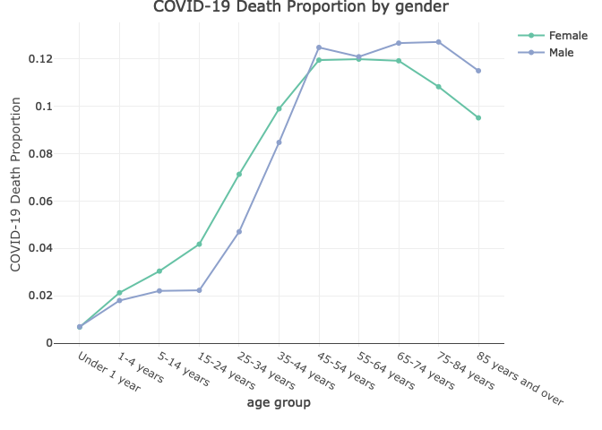
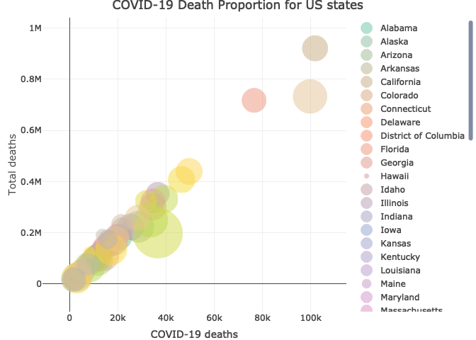
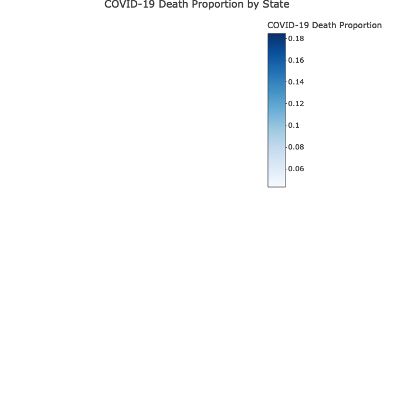
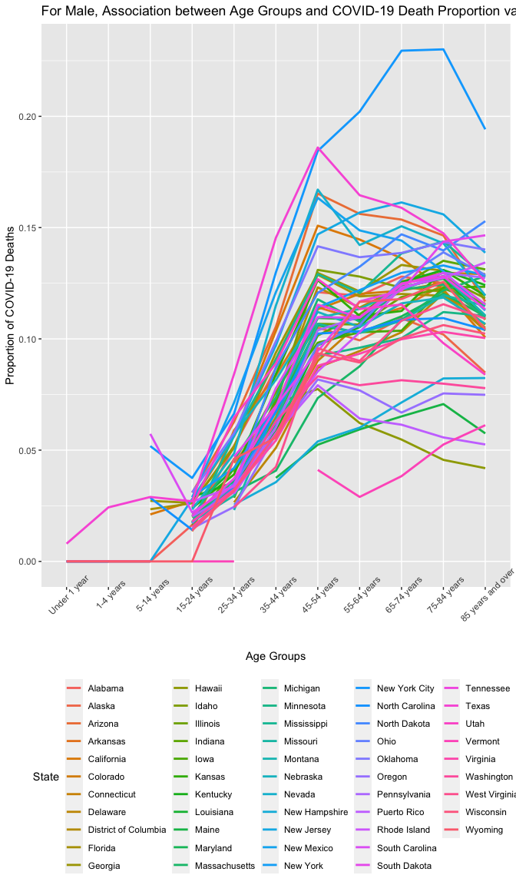
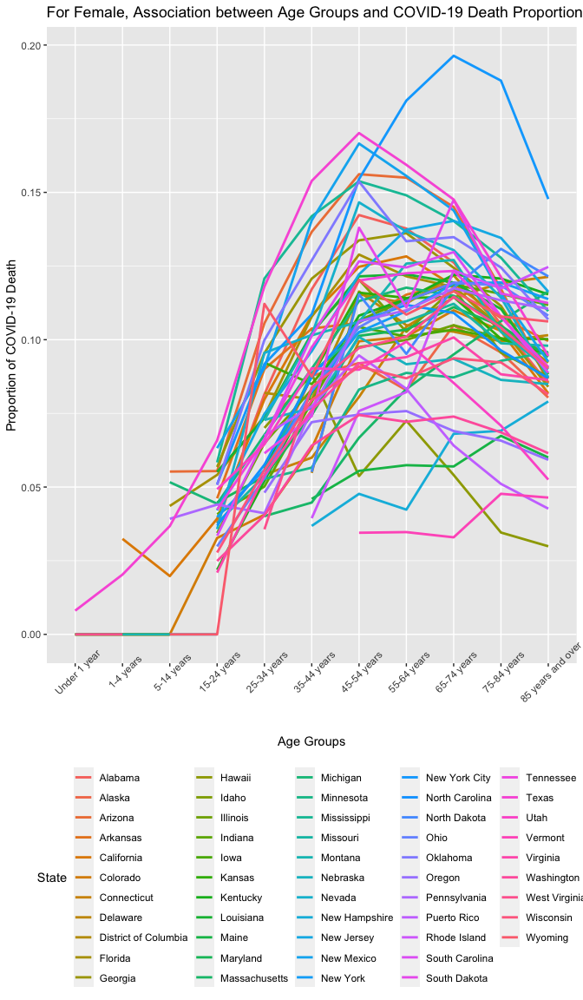

Association Analysis between Age Groups and COVID-19 Deaths Proportion
of Total Deaths
================
Xuan Huang
2022-12-03

# Introduction

Older people have higher rates of comorbidities and may experience more
inflammatory responses. Therefore,the COVID-19 deaths proportion of
total deaths for the elderly will be higher than the younger. Herein, we
aimed to explore the association between age and the deaths involving
COVID-19.

## Data Set Information

The data set in this study comes from the Nation Center for Health
Statistics, which contains death data from all residents in the USA. The
data set keep updated. I used the date set from 01/01/2020 to
11/19/2022. If you want to reproduce the study, you can assign the new
period you want. The data set I used contains 5 different attributes, of
which information is provided about each column below:

**COVID-19 Deaths: ** The number of people dying from COVID-19

**Total Deaths: ** The total number of deaths

**Age Group: ** Under 1 year, 1-4 years, 5-14 years, 15-24 years, 25-34
years, 35-44 years, 45-54 years, 55-64 years, 65-74 years, 75-84 years,
85 years and over

**Sex: ** Female, Male

**State: ** all US states

# Questions to be Addressed:

For this study, we are interested in **What is the association between
age groups and COVID-19 deaths proportion of total deaths?**

*Secondary Analyses: *

1.  Is the association between age groups and COVID-19 deaths proportion
    of total deaths sex-specific?

2.  Does the association between age groups and COVID-19 deaths
    proportion of total deaths vary from US states?

# Methods

I did some data wrangling at the beginning. I used the data from
01/01/2020 to 11/19/2022. When I checked the value of Age groups, we
found some of age groups are overlapped. So I removed those overlapped
age groups and keep those independent age groups. I calculated the
proportion of COVID-19 deaths, using COVID-19 deaths divide by total
deaths.

I did some data visualization to explore the association. I created a
table of average COVID-19 deaths proportion in different age groups to
check whether there is a trend between COVID-19 deaths proportion and
age groups. Then, I made a line-plot of COVID-19 deaths proportion by
gender to analyze the confounding of sex. Observing scatter-plot and
choropleth map of COVID-19 deaths proportion by states, I think I should
explore the association by states. By plotting the spaghetti-plot of
COVID-19 deaths proportion versus age groups by states, I got the more
specific the association between age groups and COVID-19 deaths
proportion of total deaths.

# Results

## Table 1

| Age Groups        | COVID-19 Deaths Proportion | Number of COVID-19 Deaths | Number of Total Deaths |
|:------------------|---------------------------:|--------------------------:|-----------------------:|
| Under 1 year      |                     0.0069 |                       385 |                  56066 |
| 1-4 years         |                     0.0194 |                       208 |                  10709 |
| 5-14 years        |                     0.0255 |                       427 |                  16742 |
| 15-24 years       |                     0.0275 |                      2853 |                 103750 |
| 25-34 years       |                     0.0542 |                     11859 |                 218937 |
| 35-44 years       |                     0.0896 |                     29056 |                 324271 |
| 45-54 years       |                     0.1228 |                     69299 |                 564256 |
| 55-64 years       |                     0.1205 |                    153800 |                1276536 |
| 65-74 years       |                     0.1235 |                    243333 |                1970426 |
| 75-84 years       |                     0.1181 |                    278052 |                2355170 |
| 85 years and over |                     0.1029 |                    283009 |                2749515 |

Average COVID-19 Deaths Proportion in different Age Groups

Basically, there is a trend of age groups and COVID-19 deaths
proportion. With the increase of age, the probability of dying from
COVID-19 get higher. But after 75 years old, this probability goes down.

## Figure 1

<!-- -->

From this line chart, for both female and male, the proportion of
COVID-19 deaths grow slowly before 15 years old. From 15 to 54, the
proportion increase rapidly. From 54 to 84, the proportion reach the
peak. And after 84 years old, the proportion of COVID-19 deaths go down.

For female, the growth of proportion of COVID-19 deaths is faster in
teenagers. And the decrease of proportion of COVID-19 deaths start
earlier than male.

## Figure 2

<!-- -->

The size of bubbles represent the COVID-19 Death Proportion for
different states. For example, New York City has the highest COVID-19
Death Proportion. It maybe depend on the high population density. So
people in New York will be easier to be infected with COVID-19. We’d
better stratify our data by states. So we can assume people in certain
states can have a same risk to be infected with COVID and have a same
vaccination status.

And sample size of death data also vary from states. California has the
most sample size, so California will have the much power to affect our
result.

## Figure 3

<!-- -->

In this choropleth map, dark blue means the state has a relatively high
COVID-19 death proportion. We can see the COVID-19 death proportion have
significant differences in states.

## Figure 4

<!-- -->

## Figure 5

<!-- -->

From those two spaghetti plots, we find the increase rate of COVID-19
deaths proportion for male is fast from 15 years old to 54 years old.
When age beyond 55 years, the increase rate of COVID-19 deaths
proportion get slow. For female, there is no obvious break point of the
increase rate of COVID-19 deaths proportion. At about 55 years old, the
change of COVID-19 deaths proportion converted from increase to
decrease.

# Conclusion

**There is a association between patients’ age groups and the proportion
of COVID-19 deaths. With the increase of patients’ age, the proportion
of COVID-19 deaths get higher. However, this relationship was
sex-specific. The increase rate of COVID-19 deaths proportion for male
is fast from 15 years old to 54 years old. When age beyond 55, the
increase rate of COVID-19 deaths proportion get slow. For female, there
is no obvious break point of the increase rate. Around 55 years old, the
change of COVID-19 deaths proportion converted from increase to
decrease.**
